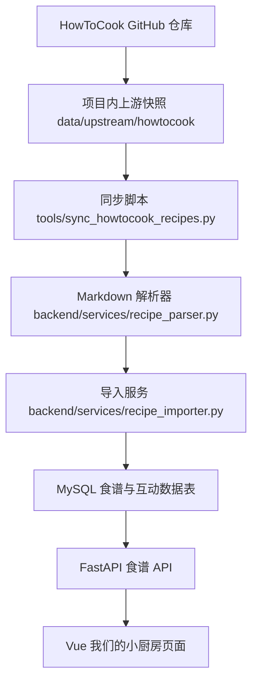
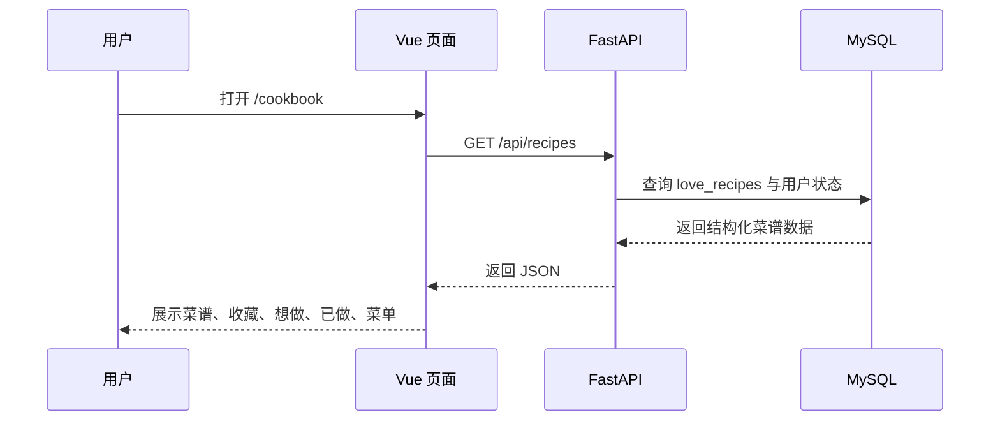
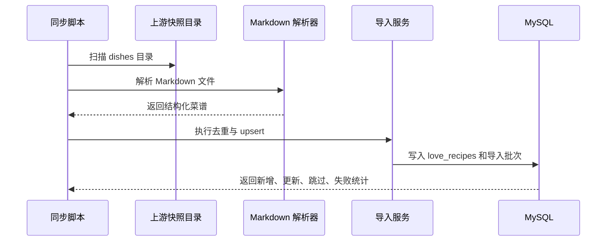

# 做菜食谱功能设计文档

## 1. 背景与目标

本项目当前是一个以情侣生活记录为核心的 Love Page 应用，后端采用 FastAPI，前端采用 Vue 3 + Vite，已有相册、音乐、时间轴、心情、足迹地图、点歌台、AI 聊天等模块。

本次新增“做菜食谱功能”，目标不是简单打开或读取 GitHub 上的 Markdown，而是将 [Anduin2017/HowToCook](https://github.com/Anduin2017/HowToCook) 作为上游菜谱源，完整集成到本项目的数据体系中，形成“我们的小厨房”模块。

核心目标：

1. 将 HowToCook 的 GitHub 菜谱内容作为上游快照纳入项目管理。
2. 通过同步脚本解析 Markdown 并写入本项目 MySQL 数据库。
3. 用户运行时只访问本项目数据库和本项目 API，不依赖 GitHub，不实时读取 Markdown 文件。
4. 在菜谱库基础上提供情侣互动能力：收藏、想做、已做、做饭记录、评分、备注、纪念日菜单、随机推荐。
5. 保留完整来源追踪：来源仓库、来源路径、来源 commit、内容 hash、原始 Markdown。

## 2. 明确的非目标

以下内容不属于第一阶段实现范围：

1. 前端运行时直接请求 GitHub Raw 文件。
2. 后端 API 每次请求时读取 Markdown 文件并现场解析。
3. 服务器启动时自动联网拉取 GitHub。
4. AI 根据食材自动生成菜谱。
5. 自动生成购物清单。
6. 营养成分分析。
7. 成品图片上传与相册深度联动。
8. 多用户协作权限细分。

这些能力可以后续扩展，但第一阶段必须先把“上游快照入库 + 原生食谱体验 + 情侣清单记录”做稳定。

## 3. 总体方案

采用“上游快照 + 结构化入库 + 本地运行时 API”的集成方案。



运行时数据流：



同步阶段数据流：



## 4. 集成边界

### 4.1 允许的读取

只允许在同步/导入阶段读取 HowToCook 快照中的 Markdown 文件，目的是生成本项目自己的结构化数据。

### 4.2 禁止的读取

1. 禁止前端运行时读取 GitHub。
2. 禁止后端业务 API 运行时读取 GitHub。
3. 禁止后端业务 API 每次详情请求时读取 Markdown 文件。
4. 禁止把 HowToCook 当作临时文件源，而不落库。

### 4.3 运行时唯一事实源

运行时唯一事实源为本项目 MySQL 数据库：

1. 菜谱内容来自 `love_recipes`。
2. 用户状态来自 `love_recipe_user_states`。
3. 做饭记录来自 `love_cooking_records`。
4. 菜单计划来自 `love_cooking_menus` 与 `love_cooking_menu_items`。

## 5. 目录与文件设计

### 5.1 新增目录

```text
D:\pythonDemo\pythonDemo\data\upstream\howtocook
D:\pythonDemo\pythonDemo\docs\做菜食谱功能
```

`data/upstream/howtocook` 用于保存 HowToCook 的上游快照。该目录不是运行时数据源，而是同步入库的数据来源归档。

### 5.2 后端新增文件

```text
D:\pythonDemo\pythonDemo\backend\routers\recipes.py
D:\pythonDemo\pythonDemo\backend\services\recipe_parser.py
D:\pythonDemo\pythonDemo\backend\services\recipe_importer.py
D:\pythonDemo\pythonDemo\tools\sync_howtocook_recipes.py
```

职责说明：

1. `backend/routers/recipes.py`
   - 提供菜谱浏览、详情、随机推荐、用户状态、做饭记录、菜单计划 API。

2. `backend/services/recipe_parser.py`
   - 纯解析模块。
   - 输入 Markdown 文本、来源路径、来源元数据。
   - 输出结构化菜谱对象。
   - 不连接数据库，便于测试。

3. `backend/services/recipe_importer.py`
   - 负责导入事务、去重、增量更新、批次记录、失败记录。
   - 根据 `source + source_path` 定位同一条上游菜谱。
   - 根据 `source_hash` 判断内容是否变化。

4. `tools/sync_howtocook_recipes.py`
   - 命令行同步入口。
   - 支持 dry-run、限制导入数量、指定来源目录、指定来源 commit。

### 5.3 前端新增或修改文件

```text
D:\pythonDemo\pythonDemo\frontend\src\views\CookbookView.vue
D:\pythonDemo\pythonDemo\frontend\src\api\index.js
D:\pythonDemo\pythonDemo\frontend\src\router\index.js
D:\pythonDemo\pythonDemo\frontend\src\views\HomeView.vue
```

第一阶段采用单页面多 Tab，避免拆分过多路由：

1. 菜谱库。
2. 想做清单。
3. 已做记录。
4. 纪念日菜单。
5. 随机推荐。

## 6. 数据库设计

### 6.1 `love_recipes`

存储 HowToCook 导入或本项目自定义的菜谱。

```sql
CREATE TABLE IF NOT EXISTS `love_recipes` (
    id BIGINT AUTO_INCREMENT PRIMARY KEY COMMENT '菜谱ID',
    source VARCHAR(30) NOT NULL DEFAULT 'howtocook' COMMENT '来源：howtocook/custom',
    source_repo VARCHAR(255) DEFAULT '' COMMENT '来源仓库URL',
    source_commit VARCHAR(80) DEFAULT '' COMMENT '来源commit',
    source_path VARCHAR(500) NOT NULL COMMENT '来源文件路径',
    source_hash CHAR(64) NOT NULL COMMENT '源文件内容SHA256',
    title VARCHAR(120) NOT NULL COMMENT '菜名',
    category VARCHAR(80) DEFAULT '' COMMENT '分类',
    description VARCHAR(500) DEFAULT '' COMMENT '简介',
    raw_markdown MEDIUMTEXT NOT NULL COMMENT '原始Markdown',
    ingredients_json JSON NULL COMMENT '结构化材料',
    steps_json JSON NULL COMMENT '结构化步骤',
    tips TEXT NULL COMMENT '小贴士',
    difficulty VARCHAR(20) DEFAULT 'unknown' COMMENT '难度：easy/medium/hard/unknown',
    cook_time_minutes INT DEFAULT NULL COMMENT '预计耗时分钟',
    servings INT DEFAULT NULL COMMENT '份量',
    tags_json JSON NULL COMMENT '标签',
    is_enabled TINYINT NOT NULL DEFAULT 1 COMMENT '是否启用',
    is_archived TINYINT NOT NULL DEFAULT 0 COMMENT '上游删除后是否归档',
    created_at TIMESTAMP DEFAULT CURRENT_TIMESTAMP COMMENT '创建时间',
    updated_at TIMESTAMP DEFAULT CURRENT_TIMESTAMP ON UPDATE CURRENT_TIMESTAMP COMMENT '更新时间',
    UNIQUE KEY uniq_recipe_source_path (source, source_path),
    KEY idx_recipe_category (category),
    KEY idx_recipe_enabled (is_enabled),
    KEY idx_recipe_source_hash (source_hash)
) ENGINE=InnoDB DEFAULT CHARSET=utf8mb4 COMMENT='做菜食谱表';
```

### 6.2 `love_recipe_import_batches`

记录每次 HowToCook 同步批次。

```sql
CREATE TABLE IF NOT EXISTS `love_recipe_import_batches` (
    id BIGINT AUTO_INCREMENT PRIMARY KEY COMMENT '导入批次ID',
    source VARCHAR(30) NOT NULL DEFAULT 'howtocook' COMMENT '来源',
    source_repo VARCHAR(255) NOT NULL COMMENT '来源仓库URL',
    source_commit VARCHAR(80) DEFAULT '' COMMENT '来源commit',
    started_at TIMESTAMP DEFAULT CURRENT_TIMESTAMP COMMENT '开始时间',
    finished_at TIMESTAMP NULL DEFAULT NULL COMMENT '结束时间',
    status VARCHAR(20) NOT NULL DEFAULT 'running' COMMENT '状态：running/success/failed/partial',
    total_files INT NOT NULL DEFAULT 0 COMMENT '总文件数',
    created_count INT NOT NULL DEFAULT 0 COMMENT '新增数量',
    updated_count INT NOT NULL DEFAULT 0 COMMENT '更新数量',
    skipped_count INT NOT NULL DEFAULT 0 COMMENT '跳过数量',
    failed_count INT NOT NULL DEFAULT 0 COMMENT '失败数量',
    error_message TEXT NULL COMMENT '批次错误信息',
    created_by VARCHAR(50) DEFAULT 'system' COMMENT '触发人'
) ENGINE=InnoDB DEFAULT CHARSET=utf8mb4 COMMENT='食谱导入批次表';
```

### 6.3 `love_recipe_import_errors`

记录导入失败的文件。

```sql
CREATE TABLE IF NOT EXISTS `love_recipe_import_errors` (
    id BIGINT AUTO_INCREMENT PRIMARY KEY COMMENT '导入错误ID',
    batch_id BIGINT NOT NULL COMMENT '导入批次ID',
    source_path VARCHAR(500) NOT NULL COMMENT '来源文件路径',
    error_type VARCHAR(80) NOT NULL COMMENT '错误类型',
    error_message TEXT NOT NULL COMMENT '错误信息',
    raw_excerpt TEXT NULL COMMENT '原文片段',
    created_at TIMESTAMP DEFAULT CURRENT_TIMESTAMP COMMENT '创建时间',
    KEY idx_import_error_batch (batch_id)
) ENGINE=InnoDB DEFAULT CHARSET=utf8mb4 COMMENT='食谱导入错误表';
```

### 6.4 `love_recipe_user_states`

记录用户对菜谱的互动状态。

```sql
CREATE TABLE IF NOT EXISTS `love_recipe_user_states` (
    id BIGINT AUTO_INCREMENT PRIMARY KEY COMMENT '状态ID',
    recipe_id BIGINT NOT NULL COMMENT '菜谱ID',
    username VARCHAR(50) NOT NULL COMMENT '用户名',
    is_favorite TINYINT NOT NULL DEFAULT 0 COMMENT '是否收藏',
    want_to_cook TINYINT NOT NULL DEFAULT 0 COMMENT '是否想做',
    cooked_count INT NOT NULL DEFAULT 0 COMMENT '做过次数',
    last_cooked_at DATE NULL COMMENT '最近做过日期',
    rating TINYINT NULL COMMENT '用户评分1-5',
    note VARCHAR(500) DEFAULT '' COMMENT '用户备注',
    created_at TIMESTAMP DEFAULT CURRENT_TIMESTAMP COMMENT '创建时间',
    updated_at TIMESTAMP DEFAULT CURRENT_TIMESTAMP ON UPDATE CURRENT_TIMESTAMP COMMENT '更新时间',
    UNIQUE KEY uniq_recipe_user_state (recipe_id, username),
    KEY idx_recipe_user_username (username),
    KEY idx_recipe_user_flags (is_favorite, want_to_cook)
) ENGINE=InnoDB DEFAULT CHARSET=utf8mb4 COMMENT='用户食谱状态表';
```

### 6.5 `love_cooking_records`

记录每次实际做饭。

```sql
CREATE TABLE IF NOT EXISTS `love_cooking_records` (
    id BIGINT AUTO_INCREMENT PRIMARY KEY COMMENT '做饭记录ID',
    recipe_id BIGINT NOT NULL COMMENT '菜谱ID',
    username VARCHAR(50) NOT NULL COMMENT '记录用户',
    cooked_date DATE NOT NULL COMMENT '做饭日期',
    rating TINYINT NULL COMMENT '评分1-5',
    mood VARCHAR(30) DEFAULT '' COMMENT '心情',
    photo_url VARCHAR(500) DEFAULT '' COMMENT '成品照片URL',
    note TEXT NULL COMMENT '做饭备注',
    next_time_improvement TEXT NULL COMMENT '下次改进',
    created_at TIMESTAMP DEFAULT CURRENT_TIMESTAMP COMMENT '创建时间',
    updated_at TIMESTAMP DEFAULT CURRENT_TIMESTAMP ON UPDATE CURRENT_TIMESTAMP COMMENT '更新时间',
    KEY idx_cooking_records_recipe (recipe_id),
    KEY idx_cooking_records_user_date (username, cooked_date)
) ENGINE=InnoDB DEFAULT CHARSET=utf8mb4 COMMENT='做饭记录表';
```

### 6.6 `love_cooking_menus`

记录纪念日菜单、周末晚餐菜单等。

```sql
CREATE TABLE IF NOT EXISTS `love_cooking_menus` (
    id BIGINT AUTO_INCREMENT PRIMARY KEY COMMENT '菜单ID',
    title VARCHAR(120) NOT NULL COMMENT '菜单标题',
    menu_date DATE NULL COMMENT '菜单日期',
    description VARCHAR(500) DEFAULT '' COMMENT '菜单描述',
    status VARCHAR(20) NOT NULL DEFAULT 'planned' COMMENT 'planned/done/cancelled',
    created_by VARCHAR(50) NOT NULL COMMENT '创建人',
    created_at TIMESTAMP DEFAULT CURRENT_TIMESTAMP COMMENT '创建时间',
    updated_at TIMESTAMP DEFAULT CURRENT_TIMESTAMP ON UPDATE CURRENT_TIMESTAMP COMMENT '更新时间',
    KEY idx_cooking_menus_user_date (created_by, menu_date),
    KEY idx_cooking_menus_status (status)
) ENGINE=InnoDB DEFAULT CHARSET=utf8mb4 COMMENT='做饭菜单表';
```

### 6.7 `love_cooking_menu_items`

记录菜单中的菜品。

```sql
CREATE TABLE IF NOT EXISTS `love_cooking_menu_items` (
    id BIGINT AUTO_INCREMENT PRIMARY KEY COMMENT '菜单明细ID',
    menu_id BIGINT NOT NULL COMMENT '菜单ID',
    recipe_id BIGINT NOT NULL COMMENT '菜谱ID',
    sort_order INT NOT NULL DEFAULT 0 COMMENT '排序',
    note VARCHAR(300) DEFAULT '' COMMENT '备注',
    created_at TIMESTAMP DEFAULT CURRENT_TIMESTAMP COMMENT '创建时间',
    UNIQUE KEY uniq_menu_recipe (menu_id, recipe_id),
    KEY idx_menu_items_menu (menu_id),
    KEY idx_menu_items_recipe (recipe_id)
) ENGINE=InnoDB DEFAULT CHARSET=utf8mb4 COMMENT='做饭菜单明细表';
```

## 7. API 设计

所有运行时接口均只查询本项目数据库。

### 7.1 菜谱列表

```http
GET /api/recipes
```

查询参数：

```text
keyword
category
tag
difficulty
max_cook_time
only_favorite
only_want_to_cook
only_cooked
page
page_size
```

返回：

```json
{
  "items": [],
  "total": 0,
  "page": 1,
  "page_size": 20
}
```

### 7.2 分类列表

```http
GET /api/recipes/categories
```

### 7.3 菜谱详情

```http
GET /api/recipes/{id}
```

返回内容包含：

1. 菜谱基础信息。
2. 材料。
3. 步骤。
4. 小贴士。
5. 来源仓库、路径、commit。
6. 当前用户状态。
7. 最近做饭记录摘要。

### 7.4 随机推荐

```http
GET /api/recipes/random
```

可选参数：

```text
category
difficulty
max_cook_time
```

### 7.5 更新用户状态

```http
POST /api/recipes/{id}/state
```

请求体：

```json
{
  "is_favorite": true,
  "want_to_cook": true,
  "rating": 5,
  "note": "周末一起做"
}
```

### 7.6 新增做饭记录

```http
POST /api/recipes/{id}/records
```

请求体：

```json
{
  "cooked_date": "2026-04-27",
  "rating": 5,
  "mood": "开心",
  "photo_url": "",
  "note": "第一次一起做，味道不错",
  "next_time_improvement": "下次少放一点盐"
}
```

### 7.7 做饭记录列表

```http
GET /api/cooking/records
GET /api/recipes/{id}/records
```

### 7.8 菜单计划

```http
GET /api/cooking/menus
POST /api/cooking/menus
GET /api/cooking/menus/{id}
PUT /api/cooking/menus/{id}
DELETE /api/cooking/menus/{id}
POST /api/cooking/menus/{id}/items
DELETE /api/cooking/menus/{id}/items/{item_id}
POST /api/cooking/menus/{id}/complete
```

## 8. Markdown 解析策略

HowToCook 中菜谱 Markdown 的结构不一定完全一致，因此解析器采用“尽量结构化 + 原文兜底”的策略。

### 8.1 标题解析

优先级：

1. Markdown 第一个一级标题。
2. Markdown 第一个二级标题。
3. 文件名去扩展名。

### 8.2 分类解析

优先使用 source_path 中 `dishes` 下的一级目录作为分类，例如：

```text
dishes/meat_dish/红烧肉/红烧肉.md
```

可推导分类为：

```text
meat_dish
```

后续前端可映射为中文展示名。

### 8.3 材料解析

识别常见标题：

```text
必备原料
原料
材料
食材
```

材料行解析为字符串数组，第一版不强制拆成数量、单位、名称三元组，避免误解析。

### 8.4 步骤解析

识别常见标题：

```text
操作
步骤
做法
制作步骤
```

按有序列表、无序列表或段落分割为步骤数组。

### 8.5 小贴士解析

识别常见标题：

```text
附加内容
小贴士
注意事项
提示
```

### 8.6 解析失败策略

单个文件解析失败时：

1. 不影响整个批次继续导入。
2. 写入 `love_recipe_import_errors`。
3. 批次状态标记为 `partial`。
4. 日志输出失败路径和错误类型。

## 9. 同步脚本设计

脚本路径：

```text
D:\pythonDemo\pythonDemo\tools\sync_howtocook_recipes.py
```

命令示例：

```powershell
python tools\sync_howtocook_recipes.py --source-dir data\upstream\howtocook --source-commit <commit> --dry-run
python tools\sync_howtocook_recipes.py --source-dir data\upstream\howtocook --source-commit <commit>
```

参数：

```text
--source-dir       HowToCook 上游快照目录
--source-commit    当前快照对应 commit
--limit            限制处理文件数，便于测试
--dry-run          只解析并输出统计，不写数据库
--created-by       触发人，默认 system
```

同步行为：

1. 扫描 `source-dir/dishes` 下所有 Markdown 文件。
2. 计算 SHA256。
3. 解析 Markdown。
4. dry-run 模式只输出统计。
5. 非 dry-run 模式创建导入批次。
6. 对每个菜谱执行 upsert。
7. `source + source_path` 已存在且 hash 未变：跳过。
8. `source + source_path` 已存在且 hash 变化：更新。
9. 不存在：新增。
10. 批次结束后更新统计。

## 10. 前端交互设计

页面名称：

```text
我们的小厨房
```

路由：

```text
/cookbook
```

页面结构：

1. 顶部标题区：
   - “我们的小厨房”
   - “今天想一起做点什么？”

2. 快捷操作区：
   - 随机一道菜。
   - 我的收藏。
   - 想做清单。
   - 已做记录。
   - 纪念日菜单。

3. 菜谱库 Tab：
   - 搜索框。
   - 分类筛选。
   - 难度筛选。
   - 耗时筛选。
   - 菜谱卡片列表。

4. 菜谱详情区：
   - 标题。
   - 分类。
   - 来源。
   - 材料。
   - 步骤。
   - 小贴士。
   - 收藏按钮。
   - 想做按钮。
   - 标记已做按钮。
   - 加入菜单按钮。

5. 想做清单 Tab：
   - 展示当前用户标记为想做的菜。
   - 支持取消想做。
   - 支持直接标记已做。

6. 已做记录 Tab：
   - 按时间倒序展示做饭记录。
   - 显示评分、心情、备注、下次改进。

7. 纪念日菜单 Tab：
   - 菜单列表。
   - 创建菜单。
   - 给菜单添加菜。
   - 完成菜单。

## 11. 权限设计

沿用现有登录体系。

### 11.1 登录用户

可以：

1. 查看菜谱。
2. 搜索、筛选、随机推荐。
3. 收藏菜谱。
4. 标记想做。
5. 新增做饭记录。
6. 创建菜单。
7. 添加菜单项。
8. 完成自己创建的菜单。

### 11.2 管理员

可以额外：

1. 执行导入脚本。
2. 隐藏菜谱。
3. 维护全局菜谱库。

第一阶段不提供后台导入页面，导入通过命令行脚本完成。

## 12. 错误处理

### 12.1 API 错误

1. 未登录返回 401，由现有前端请求封装处理跳转。
2. 无权限返回 403。
3. 菜谱不存在返回 404。
4. 请求参数非法返回 400。
5. 数据库异常记录 ERROR 日志，返回统一错误信息，不暴露 SQL 细节。

### 12.2 导入错误

1. 单文件失败不终止整个导入批次。
2. 批次级错误写入 `love_recipe_import_batches.error_message`。
3. 文件级错误写入 `love_recipe_import_errors`。
4. dry-run 模式不写库，只打印统计和失败摘要。

## 13. 安全设计

1. 所有写接口必须登录。
2. 管理类能力仅管理员可用。
3. SQL 必须使用参数化查询。
4. Markdown 原文不直接作为 HTML 注入页面，前端第一阶段采用结构化字段展示；如展示原始 Markdown，需经过安全渲染或纯文本兜底。
5. 用户输入字段限制长度：备注、标题、心情、改进建议均设置上限。
6. 日志不记录用户密码、session、token 等敏感信息。

## 14. 测试策略

### 14.1 后端测试

新增测试覆盖：

1. Markdown 标题解析。
2. Markdown 材料解析。
3. Markdown 步骤解析。
4. source_hash 计算。
5. importer 新增逻辑。
6. importer hash 未变化跳过逻辑。
7. importer hash 变化更新逻辑。
8. 菜谱列表接口。
9. 菜谱详情接口。
10. 随机推荐接口。
11. 用户状态更新接口。
12. 做饭记录新增接口。
13. 菜单创建、添加菜、完成菜单。

### 14.2 前端测试

新增测试覆盖：

1. `recipeApi` 参数构造。
2. Cookbook 页面基础渲染。
3. 搜索条件触发列表请求。
4. 收藏和想做按钮调用对应 API。
5. 新增做饭记录表单校验。
6. 菜单创建表单校验。

## 15. 验收标准

1. HowToCook 菜谱可以通过同步脚本导入本项目数据库。
2. 导入记录包含来源仓库、来源路径、来源 commit、source_hash、原始 Markdown。
3. 用户访问 `/cookbook` 时不访问 GitHub。
4. 用户访问 `/cookbook` 时后端业务 API 不读取 Markdown 文件。
5. 用户可以搜索、筛选、查看菜谱详情。
6. 用户可以收藏、标记想做、标记已做。
7. 用户可以新增做饭记录，记录评分、心情、备注和下次改进。
8. 用户可以创建纪念日菜单，并向菜单添加菜谱。
9. 后端测试和前端测试通过。
10. 构建命令通过。
11. 页面风格与现有 Love Page 保持一致。

## 16. 实施阶段

### 阶段 1：数据模型与解析器

1. 新增数据库表初始化。
2. 新增 Markdown 解析器。
3. 新增解析器单元测试。

### 阶段 2：导入服务与同步脚本

1. 新增导入服务。
2. 新增 dry-run 能力。
3. 新增 upsert 能力。
4. 新增导入批次与错误记录。
5. 新增导入服务测试。

### 阶段 3：运行时后端 API

1. 新增菜谱列表、分类、详情、随机接口。
2. 新增用户状态接口。
3. 新增做饭记录接口。
4. 新增菜单计划接口。
5. 新增 API 测试。

### 阶段 4：前端“我们的小厨房”页面

1. 新增 `/cookbook` 路由。
2. 首页新增入口。
3. 新增单页面多 Tab 视图。
4. 接入菜谱列表、详情、状态、记录、菜单 API。
5. 新增前端测试。

### 阶段 5：验收与文档补充

1. 执行后端测试。
2. 执行前端测试。
3. 执行前端构建。
4. 补充使用说明。
5. 记录导入 HowToCook 快照的操作步骤。

## 17. 设计自检

### 17.1 占位符检查

本文档不包含未定义的待办占位内容，所有第一阶段范围均有明确文件、数据表、接口和验收标准。

### 17.2 一致性检查

本文档所有运行时路径均以本项目 API 和数据库为唯一事实源；HowToCook Markdown 只在同步阶段使用，不参与用户访问链路。

### 17.3 范围检查

本文档聚焦一个可独立交付的功能模块：“我们的小厨房”。AI 推荐、购物清单、营养分析、图片上传等能力已明确排除在第一阶段之外，避免范围失控。

### 17.4 歧义检查

用户提出的“完美集成 GitHub 上面的食谱，而不是读取”已被明确解释为“上游快照入库 + 本地数据库运行时”，并写入验收标准。
